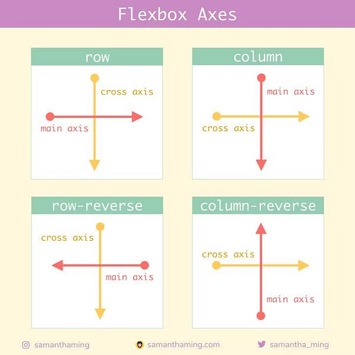

# Lesson 2: Styling with CSS

While HTML allows us to structure the content of a website, CSS (Cascading Style Sheets) allows us to control the visuals of a website and how content should be displayed.

CSS is the most significant part of front-end web development, as it can totally change the way information is
presented on a page.

For more info and documentation, [click here](https://developer.mozilla.org/en-US/docs/Learn/Getting_started_with_the_web/CSS_basics).

## Adding CSS to your website

CSS rules are defined in files ending with `.css`. Create an `index.css` file in your website folder.

In order to attribute a CSS file with your HTML, you must add a `<link>` tag to your `<head>` tag:

```html
<!DOCTYPE html>
<html>
  <head>
    ...
    <link rel="stylesheet" href="index.css" />
  </head>
  <body>
    ...
  </body>
</html>
```

The `rel="stylesheet"` attribute signifies that this `<link>` resource should be treated as a CSS stylesheet, and the
`href` attribute points to where the file is located on the web server.

## CSS selectors

In order to apply CSS rules to elements, we need to 'select' them before defining our rules. This follows the following general
syntax pattern:

```css
selector {
  rule: value;
}
```

For a full list of CSS selectors, [click here](https://www.w3schools.com/cssref/css_selectors.php).

Here are a list of example CSS selectors and the HTML that they match:

| Selector        | Match                                               | HTML                            |
| --------------- | --------------------------------------------------- | ------------------------------- |
| `div`           | Matches all div tags                                | `<div></div>`                   |
| `.container`    | Matches all elements with the `.container`          | `<div class="container"></div>` |
| `div.container` | Matches all div tags with the `.container` class    | `<div class="container"></div>` |
| `#button`       | Matches all elements with the `button` ID           | `<div id="button"></div>`       |
| `div h1`        | Matches all `h1` tags inside a `div` parent element | `<div><h1>Hello</h1></div>`     |

As you can see, selectors can be combined in order to achieve a specific result.

## CSS Properties

Some basic CSS rules include:

| Rule               | Effect                                            |
| ------------------ | ------------------------------------------------- |
| `color`            | Changes the foreground colour (text)              |
| `background-color` | Changes the element's background colour           |
| `width`            | Controls the height of the element                |
| `height`           | Controls the width of the element                 |
| `margin`           | Controls the seclusion distance around an element |
| `padding`          | Affects the internal padding around an element    |

## Containers

As we learnt in the previous lesson, some HTML elements are designed to hold elements in order to group
them together.

These are called 'containers'.

### Flexbox

In CSS, we can decide the manner in which containers display their items. For example, a popular mode is `flexbox`,
signified by using the `display: flex;` property.

For example:

```css
.container {
  display: flex;
}
```

Now, all elements with the `container` class are using the flexbox positioning system;

Flexbox is extremely useful as it allows us to easily align elements on one or two axis.

### Flexbox axis

Containers using flexbox have two axis: the **main axis and** the **cross axis**.



<br>

The **main axis** is the direction elements are positioned one after another.

We can control which direction is the main axis by defining the `flex-direction`:

```css
.container {
  display: flex;
  flex-direction: row;
}
```

Here, the main axis is **horizontal**. Child elements will be positioned in a row, side by side.

```css
.container {
  display: flex;
  flex-direction: column;
}
```

Here, the main axis is **vertical**. Child elements will be displayed in a column, one above the other.

The **cross axis** is perpendicular to the main axis.

We can control how child elements are aligned by using the `align-items` and `justify-content` properties:

`align-items` is used to align items on the **cross axis**:

```css
.container {
  display: flex;
  flex-direction: row;
  align-items: center;
}
```

Here, all elements are centred horizontally, as the `flex-direction` is set to `row`, meaning the cross axis is horizontal.

The `justify-content` property is used to align child elements on the **main axis**.

```css
.container {
  display: flex;
  flex-direction: row;
  justify-content: center;
}
```

Here, all elements are centred vertically, as the `flex-direction` is set to `row`, meaning the main axis is vertical.

Using `align-items: center;` and `justify-content: center;` allows us to centre elements both vertically and horizontally.
